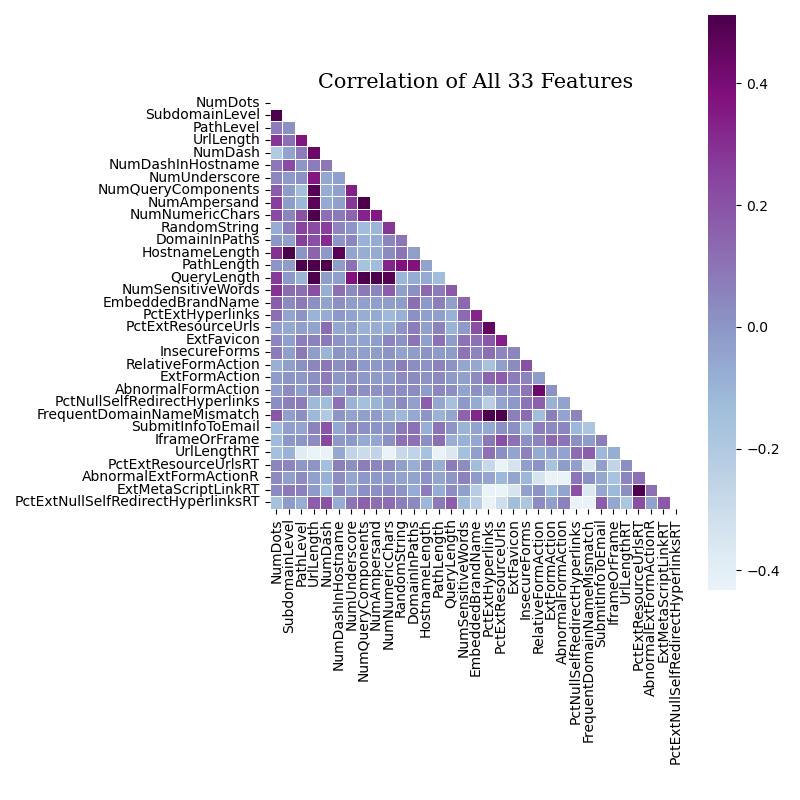
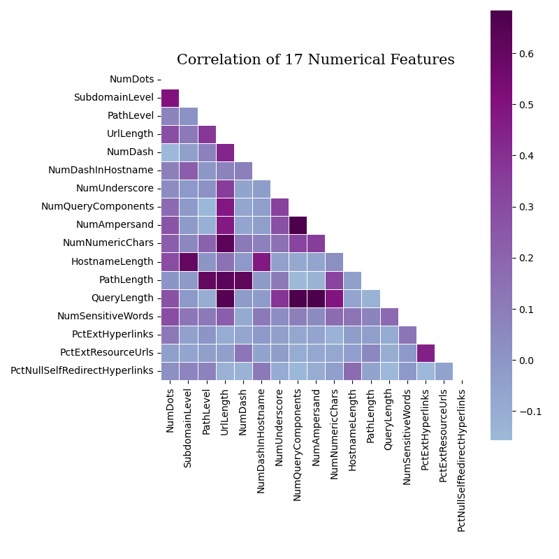
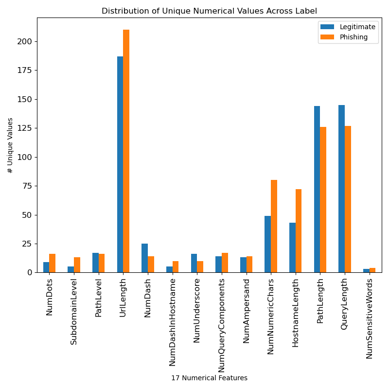
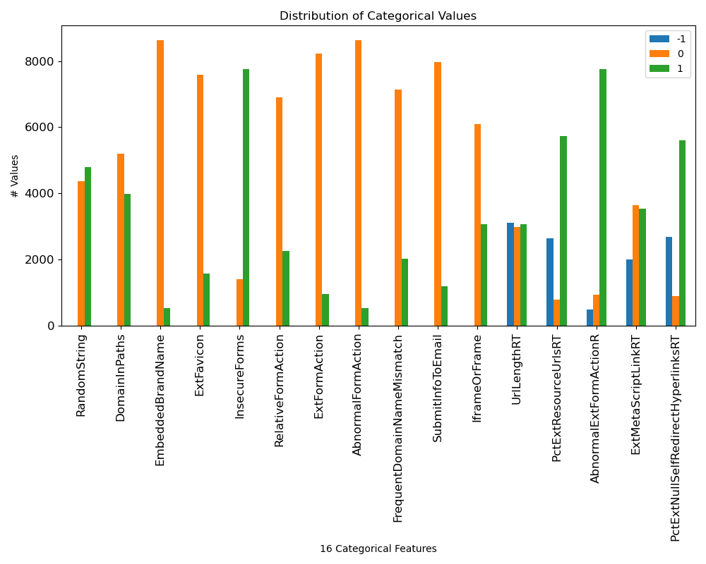
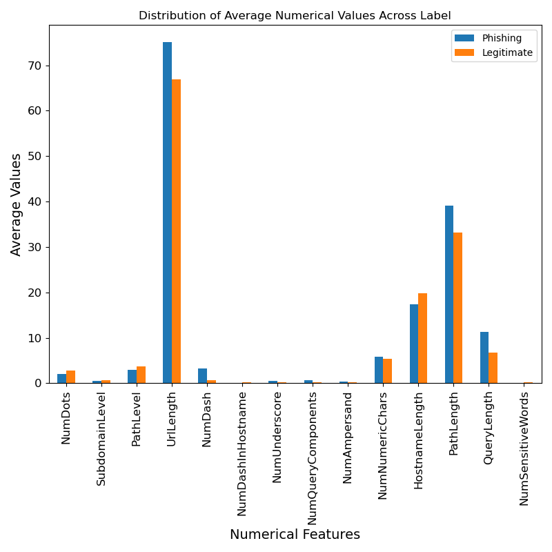
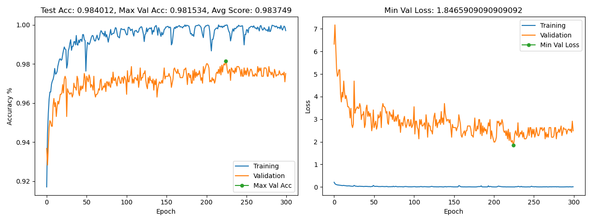

<center>

# Phishing MLP Factory
**Autor: Rob Petrovec <petrock@colostate.edu>**<br>
**Colorado State University**<br>
**CS533 - Database Management Systems**<br>
**Fall '22 Term Project**<br>
</center>

## Introduction
This project is for a simple GPU aware Binary Classifier Model Factory script to help find the best MLP model configuration for a dataset. It was scoped as a phishing vs legitimate website classifier, but could be used for any binary classification task. It will train multiple models with a variety of MLP configurations against one or more datasets. The script will create accuracy, loss & dataset mining graphs, along with the results of each model configuration & corresponding PyTorch .pt files of the trained models. When each dataset has been processed the script will produce a list of model configurations that meet or excede an accuracy threshold in descending order. This makes it useful in finding the model configuration that performs the best.<br>
<br>

----
## Setup

The script was tested with _Python 3.9_ & _Pytorch 1.11.0_ using _anaconda 22.9.0_ on _macOS Ventura 13.0_ & __CSU Server OS Version__. It may work with other package & versions, but has not been tested. An environment.yml, with expected package versions, file has been supplied for quick & easy bring up of the project.<br>
<br>
```
% git clone https://github.com/petrock99/phishingMLPFactory.git
% cd phishingMLPFactory
% conda activate
% conda env create -f environment.yml -p ./envs
% conda activate ./envs
% python main.py
```
<br>

----
## Datasets

The script will look in the _./datasets_ directory for .csv and .csv.zip files to use as datasets. If a .csv.zip file is present with no corresponding .csv file, the script will decompress the .csv.zip and use the resulting .csv as a dataset.<br>
<br>
The .csv files must contain a _Label_ feature that indicates the expected classification of each entry. The values of the _Label_ feature must be either -1 & 1, or 0 & 1 for _Legitimate_ & _Phishing_ entries respectively. The values of all other features must be either floating point or integral values.<br>
<br>
At run time, the script will preprocess the dataset to filter out irrelevant data. It will remove entries that containing NaN values as well as duplicate entries. It will also remove features with a high percentage of entries with the same value (configurable via the __kSameValueInColumnThreshold__ variable). It will then balance the dataset so that there is a 50/50 split of _Legitimate_ & _Phishing_ entries to ensure the classifier isn't biased by the dataset one way or the other. A _"dataset_filtered.csv"_ file is generated containing the filtered dataset used by the script.<br>
<br>
The script uses a _70/15/15_ dataset split for training validation and testing respectively. The 70/15/15 split was chosen to avoid overfitting the supplied DS4Tan.csv dataset. The split ratio is configurable via the __kTestDataRatio__ variable.<br>
<br>
Data mining graphs are generated to help quantify the data and guide dataset & model decisions:
- Correlation graphs of all the features and just the numeric features<br>
	<center></center><br>
- Distribution graphs of unique numerical features and categorical features<br>
	<center></center><br>
- Average distribution graph of numerical features<br>
	<center></center><br>

----
## Process

The script contains a preset list of datasets & model configurations that it will process, generating results and graphs for each. The model configurations specify the number of hidden layers and the number of nodes within each, the learning rate and the number of epochs to train with.<br>
<br>
A 70/15/15 train/validate/test split of the datase is used. Hold-Out Validation technique is employed during training to find the most accurate model state for testing. Hold-Out Validation was chosen because the script balances the number of _Legitimate_ & _Phishing_ entries into a 50/50 split, shuffles the dataset and finally applies the 70/15/15 split on the dataset. It may be interesting to try K-Fold or Stratified K-Fold Cross Validation, but may not produce significantly better results.<br>
<br>
The script processes the training, validation & test sets in batches and keeps a running tally of the accuracies of each batch. It then averages these accuracies to find the overall accuracy of each set.<br>
<br>
The script is GPU aware and will try to take advantage of CUDA enabled machines. If the script is run on non-CUDA hardware it will use the CPU. In my testing the GPU did not show significant improvement over CPU, but that is likely a bug in the code that will need to be tracked down.
<br>
To avoid overfitting, the script keeps track of the Maximum Validation Accuracy and the corresponding model state during training. It is this model state that is used during testing and saved into the _./results_ directory for later use. This is a simpler and less error prone form of Early Stopping during training.

----
## Output

The script will create timestamped directories in the _./results_ directory to write the results of each dataset & model configuration into. The timestamp corresponds to the start time of processing each dataset. The directory name is in the format _"dataset.csv year-month-day at hour.minute.second"_, like _"DS4Tan.csv 22-10-21 at 20.52.08"_, to help differentiate & compare the results from multiple runs.<br>
<br>
If a model configuration performance meets or excedes an accuracy threshold the results of the model configurations performance will be printed. Otherwise a short message expressing the models low performance is printed. This threshold is configurable via the __kHighAccuracyThreshold__ variable.<br>
<br>
An accuracy & loss graph image file will be created in the _./results_ directory for every model configuration. An example graph is shown below. The file name format is _"[hidden layer list]-learning rate-epochs-results.png"_. For example, _"[100, 150]-0.01-300-results.png"_ a model configuration with two hidden layers with 100 & 150 nodes each, a learning rate of 0.01 and 300 epochs. The Max Val Accuracy & Min Val Loss, represented by the green dots in the graphs, indicates the maximum accuracy & minimum loss during achieved during validation. It also indicates training state of the model that is used during testing.
<br>
<center></center><br>
<br>
When a dataset has been processed a _./results/high_scores.txt_ file is created containing the results of each model configuration that met or exceded the accuracy threshold, sorted by accuracy in descending order. It also contains information about the dataset being processed.<br>

```
-- Data Split (70.0 / 15.0 / 15.0) --
	All:        (9168, 34)
	Training:   (6416, 33) / (6416, 1)
	Validate:   (1376, 33) / (1376, 1)
	Test:       (1376, 33) / (1376, 1)
High Scores from 'DS4Tan.csv' in Descending Order

****************************************
hidden layers: [100, 150], epoch: 300, learning rate: 0.01
Accuracy:       0.9840116279069767
Precision:      0.9865871833084948
Recall:         0.9807407407407407
F1:             0.9836552748885588
Avg Score:      0.9837487067111927
Max Val Acc:    0.9815340909090909
Confusion Matrix:
[[692   9]
 [ 13 662]]

****************************************
hidden layers: [200, 200], epoch: 150, learning rate: 0.001
Accuracy:       0.9803779069767442
Precision:      0.9864864864864865
Recall:         0.9733333333333334
F1:             0.9798657718120806
Avg Score:      0.9800158746521611
Max Val Acc:    0.9751420454545454
Confusion Matrix:
[[692   9]
 [ 18 657]]
...
Elapsed Time: 0:03:24.754395
```
<br>

----
## ToDo

- Descriptions of experiments run: datasets used, model configs, highest performing model config/stats.
- Get the OS version used by CSU CUDA machines
- Consider K-Fold or Stratified K-Fold Cross Validation, but need to look at the Legit/Phishing split in the train/validate/test sets to see if its needed. The script already ensures the pre-split dataset has a 50/50 balance of legit/phishing after duplicate rows & irrelevant columns are removed. 