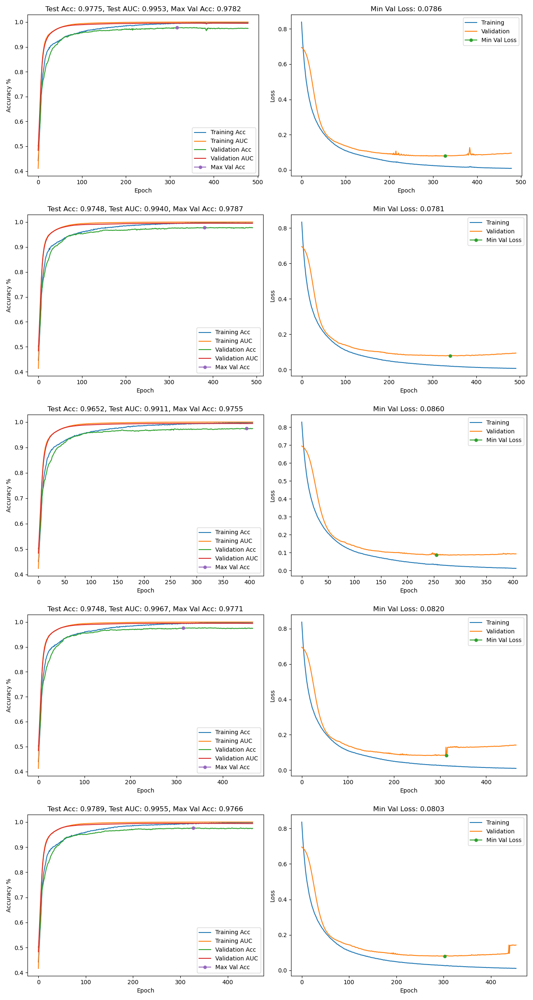
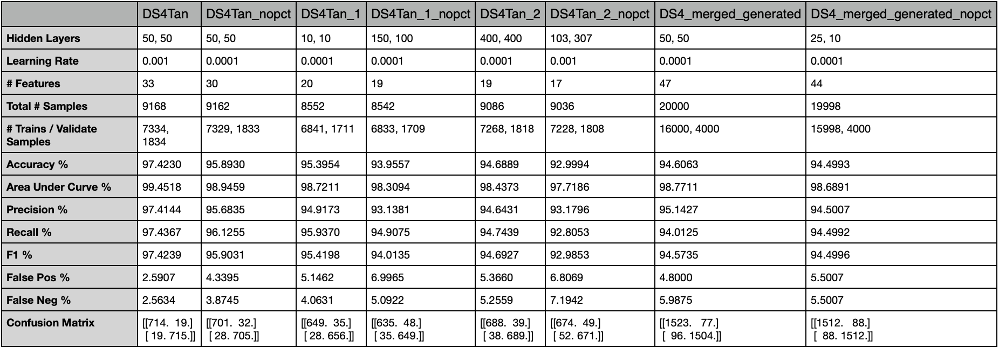

<center>

# Phishing MLP Factory
**Author: Rob Petrovec <petrock@colostate.edu>**<br>
**Colorado State University**<br>
**CS533 - Database Management Systems**<br>
**Fall '22 Term Project**<br>
</center>

## Introduction
This project is for a simple, CUDA GPU aware, script that implements a Binary Classifier Model Factory to help find the best set of hyperparameters for an MLP model. It was scoped as a phishing vs legitimate website classifier, but could be adapted for any binary classification task. It will run a grid style hyperparameter search against one or more datasets and use Stratified K-Fold Cross Validation to compare the performance of each model. The script will generate accuracy, loss & data mining graphs, along the results of each model configuration. As the script progresses it will write the results to a file sorted in descending order by accuracy. This allows the user to monitor the progress of the script and quickly see which model configurations are performing the best in real time.<br>
<br>

----
## Setup

The script was tested with _Python 3.9_, _Pytorch 1.11.0_, and _cudatoolkit 11.5.1_ using _anaconda 22.9.0_ on _macOS Ventura 13.0_ & _AlmaLinux 8.6_. It may work with other operating systems and package versions, but has not been tested. An environment.yml file has been supplied for quick & easy bring up of the project.<br>
```
% git clone https://github.com/petrock99/phishingMLPFactory.git
% cd phishingMLPFactory
% conda activate
% conda env create -f environment.yml -p ./envs
% conda activate ./envs
% python main.py
```
<br>

----
## Usage

```
% python main.py -h
usage: main.py [-h] [--csv_names CSV_NAME [CSV_NAME ...]]
               [--hidden_layers N_NODES [N_NODES ...]]
               [--learning_rates LEARNING_RATE [LEARNING_RATE ...]] [--force_cpu]
               [--batch_size BATCH_SIZE] [--epochs N_EPOCHS] [--validation_split SPLIT]
               [--accuracy_threshold THRESHOLD] [--early_stop_patience PATIENCE]
               [--common_value_threshold THRESHOLD] [--k_folds FOLDS]

optional arguments:
  -h, --help            show this help message and exit
  --csv_names CSV_NAME [CSV_NAME ...]
                        One or more .csv or .csv.zip names inside the './datasets'
                        directory. Default: 'DS4Tan.csv'
  --hidden_layers N_NODES [N_NODES ...]
                        Space separated list of the numbers representing the nodes in each
                        hidden layer. Useful for testing a specific layer configuration.
                        Default: A matrix of 42 hidden layer configurations.
  --learning_rates LEARNING_RATE [LEARNING_RATE ...]
                        Space separated list of learning rates to train with. Values
                        between 0 & 1. Default: '0.01, 0.001, 0.0001'
  --force_cpu           Force running on the CPU instead of GPU. Default: Run on GPU if
                        available, otherwise CPU.
  --batch_size BATCH_SIZE
                        Batch size used during processing. Zero will load the entire
                        dataset in one batch. Default: 0
  --epochs N_EPOCHS     Max number of epochs for training. A lower value is recommended if
                        '--validation_split' is zero. Default: 5000
  --validation_split SPLIT
                        The percentage of the dataset set aside for validation and Early
                        Stopping during training. Remainder of the dataset will be used for
                        training. Value between 0 & 1. Default: 0.2
  --accuracy_threshold THRESHOLD
                        Minimum accuracy percentage needed to print results to the console.
                        Value between 0 & 1. Default: 0.965
  --early_stop_patience PATIENCE
                        Number of epochs to wait for change before training is stopped.
                        Ignored if '--validation_split' is zero. Default: 150
  --common_value_threshold THRESHOLD
                        Minimum percentage of feature samples with the same value to allow.
                        Value between 0 & 1. Default: 0.95
  --k_folds FOLDS       Number of folds to use for K-Fold Validation. Default: 5
```
<br>

----
## Examples

`% python main.py`<br>
&ensp;&ensp;&ensp;&ensp;Run the script with its default values.<br>
<br>
`% python main.py --learning_rates 0.001 --hidden_layers 10 20 30 --validation_split 0.1`<br>
&ensp;&ensp;&ensp;&ensp;Run the script with a learning rate of 0.001, 3 hidden layers with 10, 20 & 30 nodes respectively, and a training/validation split of 90/10.<br>
<br>
`% python main.py --epochs 100 --validation_split 0 --csv_names data1.csv data2.csv`<br>
&ensp;&ensp;&ensp;&ensp;Run the default set of hyperparameters against './datasets/data1.csv' & './datasets/data2.csv' datasets for 100 epochs per training cycle. Validation and early stopping are disabled during training as well.<br>

----
## Datasets

The script will use the list of .csv file names supplied by the __--csv_names__ argument to find datasets within the _./datasets_ directory. If a .csv.zip file is present with no corresponding .csv file, the script will decompress the .csv.zip and use the resulting .csv as a dataset.<br>
<br>	
The .csv files must contain a _Label_ feature that indicates the expected classification of each sample. The values of the _Label_ feature must be either -1 & 1, or 0 & 1 for _Legitimate_ & _Phishing_ samples respectively. The values of all other features must be either floating point or integer values.<br>
<br>
At run time, the script will preprocess the dataset to filter out irrelevant data. It will remove samples containing NaN values as well as duplicate samples. It will also remove features with a high percentage of samples with the same value (configurable via __--common_value_threshold__). It will then balance the dataset so that there is a 50/50 split of _Legitimate_ & _Phishing_ samples. This is to ensure the classifier isn't biased by the dataset one way or the other. A _"dataset_filtered.csv"_ file is generated containing the filtered dataset used by the script.<br>
<br>
The script uses an _80/20_ training/validation split of the dataset, by default. It is configurable via __--validation_split__. The validation set is used for Early Stopping during training and to graph how the training is progressing.<br>
<br>
Data mining graphs are generated to help quantify the data and guide dataset & model decisions:
- Correlation graphs of all the features and just the numeric features<br>
	<center></center><br>
- Distribution graphs of unique numerical features and categorical features<br>
	<center></center><br>
- Average distribution graph of numerical features<br>
	<center></center>
- Stratified K-Fold Distribution of the Training set<br>
	<center></center>
<br>

----
## Process

The script will do a Grid Style Hyperparameter search with each specified dataset (via __--csv_names__). Each will generate a results file and graph image files for each dataset. The hyperparameters used are the number of hidden layers, the number of nodes within each hidden layer and the learning rate.<br>
<br>
A 80/20 training/validation split of the dataset is used by default, configurable via __--validation_split__. Stratified K-Fold Cross Validation is employed on the training set to compare the resulting models. The number of folds is configurable via __--k_folds__ and defaults to five. During each training epoch, the model processes the validation set to gauge how well the model is training. Training is stopped early if the validation loss does not decrease after 150 epochs. This is configurable via __--early_stop_patience__. The script keeps track of the model state corresponding to the lowest validation loss value. It will use that 'best model' state during testing. This allows the model to find its ideal state and number of epochs without excessive over-processing and with minimal overfitting.<br>
<br>
For each fold the script will process the training, validation & test sets in batches (configurable via __--batch_size__). Each batch accuracy and loss is averaged to produce the per fold accuracy and loss. The per fold accuracy and loss is averaged to find the overall accuracy and loss of the model. By default the script processes the entire dataset in one big batch. This greatly improved the speed of the script. The supplied datasets are relatively small and easily fit within GPU and CPU memory. Some investigation may be needed to speed up batching if larger datasets are used.<br>
<br>
The script will take advantage of GPUs that support CUDA. If the script is run on non-CUDA hardware it will use the CPU. __--force_cpu__ can be used to force the use of the CPU if necessary. In my experiments the GPU did not show significant speed improvement over CPU. That is likely a bug in the code that will need to be tracked down.<br>
<br>

----
## Output

The script will create timestamped directories in the _./results_ directory to write the results of each dataset & model configuration into. The timestamp corresponds to the start time of processing each dataset. The directory name is in the format _"dataset year-month-day at hour.minute.second"_, for example _"DS4Tan 22-10-21 at 20.52.08"_. Using a timestamp in the folder name helps create a semi-unique folder name to avoid name collisions and to help differentiate & compare the results from multiple datasets and runs.<br>
<br>
If a model configuration performance meets or excedes an accuracy threshold the results of the model configurations performance will be printed. Otherwise a short message expressing the models low performance is printed. This threshold is configurable via __--accuracy_threshold__.<br>
<br>
An image file for each model configuration containing the accuracy & loss graphs of each fold will be generated in the timestamped results directory. An example graph is shown below. The file name format is _"[hidden layer list]-learning rate-results.png"_. For example, _"[50, 50]-0.001-results.png"_ represents a model configuration with two hidden layers with 50 nodes each and a learning rate of 0.001. _Training AUC_ & _Validation AUC_ represent the training and validation area under the ROC curve. _Max Val Accuracy_ and _Min Val Loss_, represented by the green dots in the graphs, indicates the maximum accuracy & minimum loss achieved during validation. _Min Val Loss_ also indicates the epoch at which the model state was saved for use during testing.
<br>
<center></center><br>
<br>

At the start of every run, a metrics file is created in the timestamped results directory with the format _"dataset-metrics.txt"_. For example, _"DS4Tan-metrics.txt"_. This file contains information about the dataset and model configuration as well as a list of results from each model that was processed. This includes the model configuration, data points about each fold, overall accuracy and other metrics to help analyze the performance of the model. This results list is sorted by accuracy in descending order and is continually updated throughout training. This allows the user to monitor the performance of each configuration live and get a good sense of how well the models are performing. One common method to view changes to a file live is by using the _watch -head_ command. It will keep the beginning of the file pinned to the top of the terminal window so the model configuration with the highest accuracy at that moment is always visible. The script will print out the proper command, and path to the metrics file, at the beginning of each run for easy copy and pasting into a separate terminal window.<br>

```
-- Dataset 'DS4Tan.csv' --
	Split:      80.0 / 20.0
	All:        (9168, 34)
	Training:   (7334, 33) / (7334, 1)
	Validate:   (1834, 33) / (1834, 1)

-- Stats --
	Batch Size:                       Full Dataset
	Early Stop Patience:              150
	Common Column Value Threshold:    0.95
	Number of Folds:                  5

-- Metrics in Accuracy Descending Order --

****************************************
hidden layers: [50, 50], learning rate: 0.001
fold: 0 -- Accuracy: 0.9775, AUC: 0.9953, Min Val Loss: 0.0786, Min Val Loss Epoch: 327, Elapsed Time: 0:00:29.045767
fold: 1 -- Accuracy: 0.9748, AUC: 0.9940, Min Val Loss: 0.0781, Min Val Loss Epoch: 340, Elapsed Time: 0:00:29.800506
fold: 2 -- Accuracy: 0.9652, AUC: 0.9911, Min Val Loss: 0.0860, Min Val Loss Epoch: 255, Elapsed Time: 0:00:24.785619
fold: 3 -- Accuracy: 0.9748, AUC: 0.9967, Min Val Loss: 0.0820, Min Val Loss Epoch: 314, Elapsed Time: 0:00:28.130508
fold: 4 -- Accuracy: 0.9789, AUC: 0.9955, Min Val Loss: 0.0803, Min Val Loss Epoch: 302, Elapsed Time: 0:00:27.507045

Accuracy %:          97.4230
Area Under Curve %:  99.4518
Precision %:         97.4144
Recall %:            97.4367
F1 %:                97.4239
False Pos %:         2.5907
False Neg %:         2.5634
Elapsed Time:        0:02:21.058911
Confusion Matrix:
[[714.  19.]
 [ 19. 715.]]


****************************************
hidden layers: [5, 10], learning rate: 0.01
fold: 0 -- Accuracy: 0.9721, AUC: 0.9931, Min Val Loss: 0.0795, Min Val Loss Epoch: 268, Elapsed Time: 0:00:24.364997
fold: 1 -- Accuracy: 0.9734, AUC: 0.9954, Min Val Loss: 0.0861, Min Val Loss Epoch: 458, Elapsed Time: 0:00:35.555528
fold: 2 -- Accuracy: 0.9680, AUC: 0.9943, Min Val Loss: 0.0860, Min Val Loss Epoch: 201, Elapsed Time: 0:00:20.658526
fold: 3 -- Accuracy: 0.9734, AUC: 0.9951, Min Val Loss: 0.0886, Min Val Loss Epoch: 205, Elapsed Time: 0:00:20.863612
fold: 4 -- Accuracy: 0.9714, AUC: 0.9942, Min Val Loss: 0.0897, Min Val Loss Epoch: 132, Elapsed Time: 0:00:16.481482

Accuracy %:          97.1639
Area Under Curve %:  99.4431
Precision %:         97.0381
Recall %:            97.3001
F1 %:                97.1677
False Pos %:         2.9725
False Neg %:         2.6998
Elapsed Time:        0:01:59.809393
Confusion Matrix:
[[712.  22.]
 [ 20. 714.]]
...
------------------------------------------
Elapsed Time: 0:03:24.754395
```
<br>

----
## Sample Datasets

Eight sample datasets are included with this project.
<br>
<ul>
	<li>
		DS4Tran.csv
		<ul style="list-style: none;">
			<li>The base dataset that all the other datasets are generated from. It contains 10k samples with a 50/50 split of legitimate/phishing website data samples.
		</ul>
	</li>
	<li>
		DS4Tan_nopct.csv<br>
		<ul style="list-style: none;">
			<li>Same as DSTran.csv but with the PctXXX features removed.
		</ul>
	</li>
	<li>
		DS4Tan_1.csv<br>
		<ul style="list-style: none;">
			<li>Based on DSTran.csv with odd features removed, starting at 'TildeSymbol', and some feature values offset to avoid zeros.<br>
			<br>
			Common features between DS4Tan_1.csv and DS4Tan_2.csv are 'NumDots','SubdomainLevel','PathLevel','UrlLength','NumDash','NumDashInHostname'.<br>
			<br>
			Removed features include 'TildeSymbol', 'NumPercent', 'NumAmpersand', 'NumNumericChars', 'RandomString', 'DomainInSubdomains', 'HttpsInHostname', 'PathLength', 'DoubleSlashInPath', 'EmbeddedBrandName', 'PctExtResourceUrls', 'InsecureForms', 'ExtFormAction', 'PctNullSelfRedirectHyperlinks', 'FakeLinkInStatusBar', 'PopUpWindow', 'IframeOrFrame', 'ImagesOnlyInForm', 'UrlLengthRT', 'AbnormalExtFormActionR' and 'PctExtNullSelfRedirectHyperlinksRT'.<br>
		</ul>
	</li>
	<li>
		DS4Tan_1_nopct.csv<br>
		<ul style="list-style: none;">
			<li>Based on DS4Tan_1.csv but with the PctXXX features removed.
		</ul>
	</li>
	<li>
		DS4Tan_2.csv<br>
		<ul style="list-style: none;">
			<li>Based on DSTran.csv with even features removed, starting at 'TildeSymbol', and some feature values offset to avoid zeros.<br>
			<br>
			Common features between DS4Tan_1.csv and DS4Tan_2.csv are 'NumDots','SubdomainLevel','PathLevel','UrlLength','NumDash','NumDashInHostname'.<br>	
			<br>
			Removed features include 'NumUnderscore', 'NumQueryComponents', 'NumHash', 'NoHttps', 'IpAddress', 'DomainInPaths', 'HostnameLength', 'QueryLength', 'NumSensitiveWords', 'PctExtHyperlinks', 'ExtFavicon', 'RelativeFormAction', 'AbnormalFormAction', 'FrequentDomainNameMismatch', 'RightClickDisabled', 'SubmitInfoToEmail', 'MissingTitle', 'SubdomainLevelRT', 'PctExtResourceUrlsRT', 'ExtMetaScriptLinkRT'.<br>
		</ul>
	</li>
	<li>
		DS4Tan_2_nopct.csv<br>
		<ul style="list-style: none;">
			<li>Based on DS4Tan_2.csv but with the PctXXX features removed.
		</ul>
	</li>
	<li>
		DS4_merged_generated.csv<br>
		<ul style="list-style: none;">
			<li>A generated dataset based on DS4Tan_1.csv and DS4Tan_2.csv. It is unclear, at this time, how the samples were generated. A major issue with this dataset is that all of the floating point values have been converted to integer. This makes features like the PctExtHyperlinks, and similar percentage based features with values between 0 and 1, into binary values of either 0 or 1. This severely limits the usefulness of the dataset because the PctXXX features are major distinguishing features. Efforts are underway to regenerate this dataset with the floating point values intact.
		</ul>
	</li>
	<li>
		DS4_merged_generated_nopct.csv<br>
		<ul style="list-style: none;">
			<li>Based on DS4_merged_generated.csv but with the PctXXX features removed.
		</ul>
	</li>
</ul>
<br>

----
## Experiments

Various experiments were performed during development of this project using the included datasets. The script was initially developed on the DS4Tan.csv dataset with a simple train/test Hold-Out validation scheme. It achieved accuracies in the 92% to 95% range fairly quickly. Over several weeks of development, train/validate/test scheme was adopted along with an Early Stopping technique which improved the performance to between 94% and 98%. In addition support for results directory uniquing, live updating metrics log files, graph image generation, command line argument support and other features to help with data analysis were implemented. Finally Stratified K-Fold Cross Validation was adopted with a train/validate scheme. This achieved accuracies between 95% and 97%.<br>
<br>
One of the goals of this project was to find and compare the highest performing models for each dataset. Due to an issue in how _DS4_merged_generated.csv_ was created all of the values were changed from floating point to integer via rounding. This made all the _PctXXX_ features contain only 1s or 0s, effectively crippling the dataset. In order to make a somewhat proper comparison of datasets and models the _XXX_nopct.csv_ datasets were created with all of the _PctXXX_ features removed.<br>
<br>

----
## Future Plans

I'd like to:<br>
- Fix _DS4_merged_generated.csv_ floating point to integer problem and rerun the experiments on it.
- Find out how _DS4_merged_generated.csv_ is created. 
- Figure out why running the script on a GPU isn't significantly faster than on the CPU.
- Add a __--result_path__ command line argument to specify where the results will be written.
- Change the timestamped results folder to be just the date and time. The timestamped results directory then contains a folder per dataset. Each dataset folder would contain the results from that dataset.
- Add support to generate a results table file from the metrics file for each dataset.
- Add support for paths to __--csv_names__.
- Add support for multiple lists of hidden layers to __--hidden_layers__.
- Profile the script to see if any performance speed ups could be made.
<br>

----
## Conclusion

The final set of experiments consisted of running the script with default values against all of the supplied datasets distributed among a few CS department machines with CUDA GPUs. After many hours of processing some observations became clear:<br>

- _DS4Tran.csv_ performed the best overall with a __97.4%__ accuracy on a model configured with [50, 50] hidden layers and a learning rate of 0.001
- _DS4Tran_nopct_.csv_ does the second best with a __95.9%__ accuracy on a model configured with [50, 50] hidden layers and a learning rate of 0.0001
- Removing the _PctXXX_ features reduces the accuracy by about 2% across the board.
- All the datasets, except for _DS4_merged_generated.csv_ and _DS4_merged_generated_nopct.csv_ contained a lot of duplicate samples and columns with 95% of the values the same. This reduced the dataset down considerably. Its unclear if it had an effect on the results, however.
- _DS4_merged_generated_nopct.csv_ (__94.5%__) performed marginally better than _DS4Tan_1_nopct.csv_ (__93.96%__) and _DS4Tan_2_nopct.csv_ (__93%__) datasets.
- _DS4_merged_generated_nopct.csv_ (__94.5%__) performed about 1.5% worse than _DS4Tran_nopct_.csv_ (__95.9%__).
- Models with a learning rate of 0.01 converged very quickly. Sometimes in less than 100 epochs.
- The accuracy and loss curves for models with a 0.01 learning rate were very erratic. This indicates the model will produce unreliable results. A high accuracy or low loss were almost by chance.
- Models with a learning rate of 0.001 converged at a moderate pace. Typically within 200 and 500 epochs.
- Models with a learning rate of 0.0001 converged very slowly. Often taking 3000 to 4000 epochs for the loss values to stop decreasing and the training to stop.
- The accuracy and loss curves for models with 0.001 and 0.0001 learning rates were smooth and followed similar trajectories. The loss curve after the Minimum Validation Loss point was noticeably trending upwards. This indicates that the model was starting to overfit after the Minimum Validation Loss point. Therefor, the Minimum Validation Loss was the apex of the curve and produced a model with minimum loss and minimal overfitting.
- Stratified K-Fold Cross Validation helped tremendously in comparing different models.
- The area under the ROC curve percentages did not help much in evaluating the models. They were all between 98% and 99.9%.
<br>
<br>
Table of the results of each of the highest performing models per dataset:
<center></center><br>
<br>